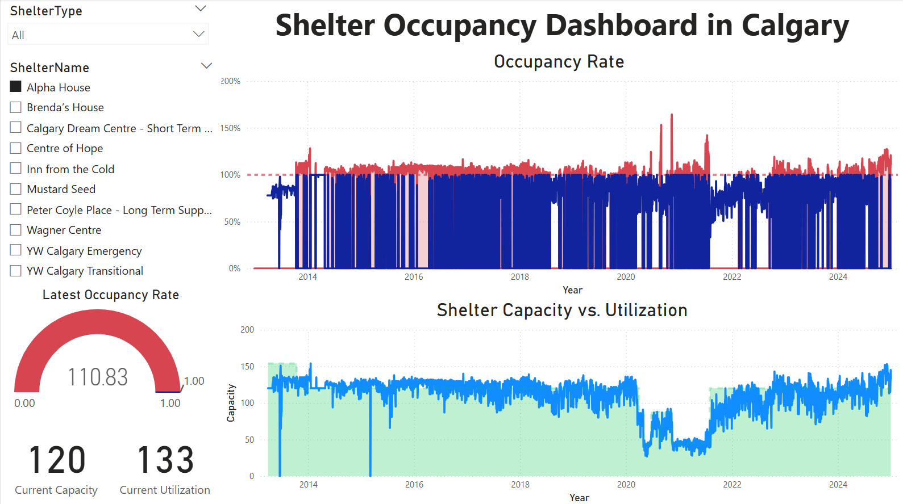
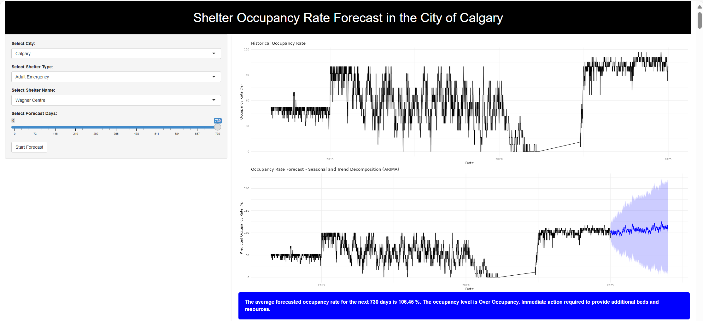

# Improving Emergency Shelter Utilization through Time Series Forecasting

This repository presents a data-driven platform developed to improve emergency shelter resource planning in Calgary. As part of the Business Certificate Capstone (MNGT-257) at the Southern Alberta Institute of Technology (SAIT), our team built a real-time dashboard, forecasting tool, and action plan toolkit to help shelters anticipate and respond to occupancy trends.

## 📌 Project Overview

Emergency shelters in Calgary face highly seasonal and unpredictable demand. Existing tools like ShelterLink provide real-time availability, but lack predictive capabilities. Our platform combines 10+ years of historical data (2013–2024) with time series forecasting (ARIMA models) and Power BI dashboards to provide proactive planning and reduce overcrowding.

---

## 📁 Project Files

### 1. 📄 Final Project Report  
**`Shelter_Occupancy_Forecasting_Final_Report.docx`**  
Comprehensive documentation including project scope, methodology, literature review, competitive analysis, forecasting results, stakeholder analysis, and action strategies.

### 2. 📊 Shelter Occupancy Dashboard  
**`Shelter_Occupancy.pbix`**  
Power BI report that visualizes historical and current shelter occupancy data, identifies trends, and supports strategic planning.  

### 3. 📈 Forecasting Model (R Script)  
**`shelter_occupancy_forecast.R`**  
R script that builds a time series forecasting model using ARIMA to predict shelter occupancy for the next two years based on cleaned historical data.  

### 4. 🧾 Raw Dataset  
**`shelter_data.csv`**  
Original emergency shelter occupancy data from Alberta Open Data covering 2013–2024.

### 5. 🧹 Cleaned Dataset  
**`data_cleaned.csv`**  
Pre-processed version of the dataset used for forecasting and dashboard integration.

### 6. 📽️ Capstone Presentation  
**`Shelter_Occupancy_Forecasting_Capstone_Presentation.pdf`**  
Summarizes project scope, methodology, tools used, forecasting outcomes, and action plan insights. Presented during CapCon 2025 at SAIT.

### 7. 📄 Action Plan Toolkit  
**`Shelter_Occupancy_Action_Plan_Strategies.pdf`**  
Outlines specific response strategies triggered by forecasted occupancy thresholds (Low, Moderate, High, Over). Helps shelters plan staffing, resource allocation, and overflow procedures based on projected trends.

### 8. 📋 Presentation Resource Sheet  
**`Resource_Sheet.pdf`**  
One-page summary used during CapCon 2025 to highlight the project's goals, problem statement, solution components (dashboard, forecast model, action plan), and technical validation.  

---

## 💡 Key Highlights
- 🔍 Forecasting with real-world shelter data
- 🧠 Built with ARIMA models for accurate, seasonal trend capture
- 💼 Validated with YW Calgary mentor Randy Thornhill
- 📉 Real-time dashboards + automated insights for decision-makers
- 📱 Scalable, nonprofit-friendly and adaptable for other cities

---

## 👨‍💼 Team Role – Prajwal Nagaraj
- 🛠️ Role: Technical Lead
- 🧪 Built and refined the ARIMA forecasting model using R
- 📊 Integrated forecasts into an interactive Power BI dashboard
- 🔄 Participated in sprint-based Agile development and stakeholder meetings

---

## 📬 Contact & Acknowledgments

**Mentor**: Randy Thornhill, YW Calgary  
**Showcased at**: CapCon 2025, SAIT Business School Showcase  
**Special Thanks**: SAIT Instructors, Calgary Drop-In Centre, and our peers

---

## 🔗 Related Links

- [Forecasting Web App (Live)](https://firstconsultinggroup.shinyapps.io/ShelterOccupancyForecast/)
- [Power BI Dashboard (Live Demo)](https://app.powerbi.com/links/0-YCl6BC8x?ctid=f52f2183-9f67-4ad2-b656-6f754fe196cb&pbi_source=linkShare)
- [SAIT Business Programs](https://www.sait.ca/programs-and-courses)

---

> 📌 _This project demonstrates how predictive analytics can drive real-world social impact, improve service planning, and support vulnerable communities._
